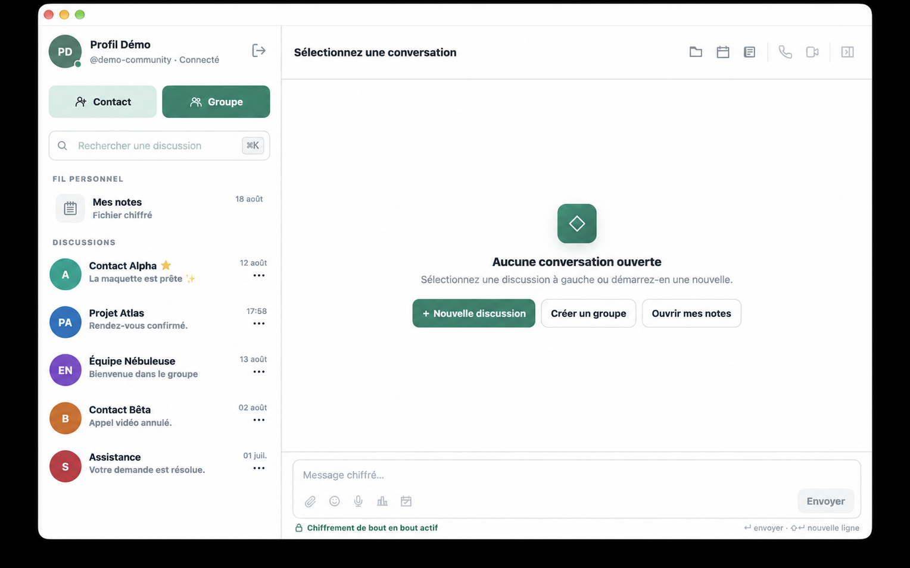

# Vibration

Application de messagerie web installable, responsive et chiffrée côté navigateur. Le serveur Go assure l’authentification, le routage REST/WebSocket, la persistance SQLite et les notifications Web Push, sans jamais déchiffrer les messages, noms de groupes ou fichiers.

<p align="center">
  
</p>

<p align="center"><strong>Vibration Community 1.0.26</strong> · Messagerie chiffrée auto-hébergeable · Web, mobile et PWA</p>

## Philosophie

Vibration est né d'une idée simple : permettre à chacun de reprendre la maîtrise de ses données et de ses communications.

La version publiée sur GitHub est l’édition **Community**. Elle permet d’installer une messagerie privée sur son propre serveur, avec un serveur Go léger, une interface web/PWA et une base SQLite locale. Le contenu des conversations reste chiffré côté navigateur : le serveur stocke et route les données, mais ne lit pas les messages ni les fichiers.

## Édition Community

La version Community est volontairement simple à installer, à inspecter et à auto-héberger. Elle réunit dans une seule interface les échanges, les fichiers et les outils de coordination d’une équipe.

Elle inclut :

- **messagerie** : conversations privées et groupes, réponses, réactions, accusés envoyé/reçu/lu, présence, saisie en temps réel, favoris, messages épinglés et messages éphémères ;
- **organisation** : sondages chiffrés, évènements, calendrier global, export iCal local et retour direct à la discussion d’origine ;
- **fichiers** : pièces jointes et messages vocaux chiffrés, dossier global, aperçus PDF/Office/médias et liens de partage temporaires révocables ;
- **contacts et vie privée** : carnet d’adresses, recherche des membres visibles de l’instance par nom d’utilisateur, profil invisible et code privé renouvelable pour les contacts de confiance ;
- **sécurité** : clés ECDH/ECDSA, enveloppes Argon2id, signatures vérifiées, empreintes d’identité, code de récupération et signalements sans transmission du message chiffré ;
- **multi-appareil** : appareils de confiance, approbation par QR code ou code court, inventaire des sessions et révocation depuis le profil ;
- **collaboration en direct** : appels audio/vidéo WebRTC, partage d’écran et tableau blanc partagé ;
- **expérience web et mobile** : interface responsive en six langues, PWA, cache de l’interface, notifications Web Push et reconnexion automatique ;
- **auto-hébergement** : serveur Go compact, base SQLite locale et aucun service d’analytique ou de télémétrie Vibration requis.

## Comparatif Community et Enterprise

L’édition Enterprise reprend toutes les fonctionnalités de Community et ajoute les outils d’administration, d’exploitation et de fédération destinés aux organisations.

| Domaine | Fonctionnalité | Community | Enterprise |
| --- | --- | --- | --- |
| **Distribution** | Licence | GPL-3.0-or-later | GPL-3.0-or-later pour le code livré au client |
| **Distribution** | Accès au code | Dépôt GitHub public | Code de la version livré au client |
| **Distribution** | Auto-hébergement | ✅ Serveur Go autonome | ✅ Serveur Go avec modules d’exploitation |
| **Distribution** | Application web responsive | ✅ Web et PWA | ✅ Web, PWA et interfaces Enterprise |
| **Distribution** | Packaging desktop/mobile Tauri | — Non publié | ✅ Selon le déploiement |
| **Distribution** | Support | Communauté et exploitation autonome | Support commercial et accompagnement |
| **Messagerie** | Conversations privées et groupes | ✅ | ✅ |
| **Messagerie** | Chiffrement des messages dans le navigateur | ✅ AES-GCM | ✅ AES-GCM |
| **Messagerie** | Réponses, réactions, favoris et messages épinglés | ✅ | ✅ |
| **Messagerie** | Messages éphémères | ✅ | ✅ |
| **Messagerie** | Accusés envoyé, reçu et lu | ✅ | ✅ |
| **Messagerie** | Présence et saisie en temps réel | ✅ | ✅ |
| **Messagerie** | Messages vocaux chiffrés | ✅ | ✅ |
| **Messagerie** | Signalements sans transmettre le contenu chiffré | ✅ Création et retrait par l’utilisateur | ✅ Avec traitement par la modération |
| **Fichiers** | Fichiers, noms et types MIME chiffrés | ✅ Jusqu’à 25 Mo | ✅ Jusqu’à 25 Mo |
| **Fichiers** | Dossier global et aperçus PDF/Office/médias | ✅ | ✅ |
| **Fichiers** | Liens publics temporaires et révocables | ✅ Clé conservée dans le fragment de l’URL | ✅ Clé conservée dans le fragment de l’URL |
| **Organisation** | Sondages chiffrés avec expiration | ✅ | ✅ |
| **Organisation** | Évènements et calendrier global | ✅ | ✅ |
| **Organisation** | Export iCal local | ✅ | ✅ |
| **Contacts** | Carnet d’adresses et recherche des membres visibles | ✅ | ✅ |
| **Contacts** | Profil invisible et code privé renouvelable | ✅ | ✅ |
| **Sécurité** | Identité ECDH/ECDSA et empreintes persistantes | ✅ | ✅ |
| **Sécurité** | Clés privées protégées par AES-GCM et Argon2id | ✅ | ✅ |
| **Sécurité** | Signatures individuelles vérifiées avant déchiffrement | ✅ | ✅ |
| **Sécurité** | Migration des anciennes enveloppes PBKDF2 | ✅ | ✅ |
| **Sécurité** | Code personnel de récupération du compte | ✅ | ✅ |
| **Multi-appareil** | Appareils de confiance | ✅ | ✅ |
| **Multi-appareil** | Approbation par QR code ou code court | ✅ | ✅ |
| **Multi-appareil** | Inventaire et révocation de ses propres sessions | ✅ | ✅ |
| **Appels** | Appels audio/vidéo WebRTC dans une même instance | ✅ | ✅ |
| **Appels** | Partage d’écran | ✅ Selon le navigateur | ✅ Selon le navigateur |
| **Appels** | Tableau blanc partagé | ✅ | ✅ |
| **Appels** | Serveurs ICE | STUN public de secours | STUN et Coturn privé configurables |
| **Appels** | Appels audio/vidéo entre instances | — Non fédérés | ✅ `federated-calls-v1` entre instances approuvées |
| **Appels** | Groupes fédérés | — | ✅ Plusieurs participants locaux et un participant distant |
| **Expérience** | Interface en six langues | ✅ Français, anglais, espagnol, italien, portugais et allemand | ✅ Mêmes langues |
| **Expérience** | Installation PWA et cache de l’interface | ✅ | ✅ |
| **Expérience** | Notifications Web Push sans contenu clair | ✅ | ✅ |
| **Expérience** | Reconnexion automatique après suspension mobile | ✅ | ✅ |
| **Administration** | Inscriptions | Ouvertes lorsque l’instance est publique | Configurables |
| **Administration** | Code d’activation et invitations | — | ✅ |
| **Administration** | Conditions d’utilisation | ✅ Acceptation obligatoire | ✅ Texte et activation administrables |
| **Administration** | Rôles administrateur et gestionnaire | — | ✅ |
| **Administration** | Console d’administration et panneau gestionnaire | — | ✅ |
| **Administration** | Promotion, rétrogradation, bannissement et débannissement | — | ✅ |
| **Administration** | Révocation administrative des sessions | — | ✅ |
| **Administration** | Modération par métadonnées sans accès au contenu clair | — | ✅ |
| **Administration** | Journal d’audit des actions | — | ✅ |
| **Administration** | Quotas de stockage des fichiers | — | ✅ Configurables |
| **Administration** | Configuration et test WebRTC/Coturn | — | ✅ |
| **Données** | Base SQLite locale | ✅ Seule base prise en charge | ✅ |
| **Données** | MariaDB/MySQL et PostgreSQL | — | ✅ |
| **Données** | Migration ou recopie de la base | — | ✅ |
| **Données** | Sauvegarde, téléchargement et restauration depuis l’administration | — | ✅ |
| **Données** | Remise à zéro protégée et redémarrage administré | — | ✅ |
| **Fédération** | Connexion entre instances approuvées | — Non incluse | ✅ Confiance explicite entre administrateurs |
| **Fédération** | Messages, fichiers, réactions, épingles et accusés | — | ✅ |
| **Fédération** | Présence et saisie en temps réel | — | ✅ |
| **Fédération** | Sondages et évènements | — | ✅ |
| **Fédération** | Conversations privées | — | ✅ |
| **Fédération** | Groupes | — | ✅ Limité actuellement à une instance distante |

Le périmètre des appels et groupes fédérés est détaillé dans [Community et Enterprise](COMMUNITY_VS_ENTERPRISE.md). L’offre Enterprise est présentée sur [vibration-shop.appbox.fr](https://vibration-shop.appbox.fr).

## Nouveautés

### Community 1.0.26

- **Partage de fichiers plus lisible** : après la création d’un lien sécurisé, la fenêtre se concentre sur les actions « Copier le lien » et « Désactiver le lien » sans répéter ce nouveau lien dans « Vos liens précédents ».
- **Historique conservé dans le Dossier** : les liens de partage déjà actifs restent consultables et révocables lors de l’ouverture d’un document depuis le Dossier.
- **Compteur de partages synchronisé** : la création et la désactivation du lien mettent immédiatement à jour l’état du document dans le Dossier.
- **Cache PWA v383** : les scripts et métadonnées de cette version sont renouvelés ensemble pour garantir son déploiement immédiat.

### Community 1.0.25

- **Repères visuels dans les conversations** : les échanges directs, les groupes et Mes notes disposent maintenant d’une présentation illustrée propre à leur usage, conservée au-dessus des messages.
- **Accueil Vibration enrichi** : lorsqu’aucune discussion n’est affichée, l’identité Vibration et sa vocation de messagerie chiffrée, collaborative et souveraine accompagnent l’invitation à sélectionner une conversation.
- **Groupes immédiatement reconnaissables** : leur illustration utilise deux bulles de discussion superposées, assorties au fond et aux couleurs de l’interface.
- **Interface traduite dans les six langues** : tous les nouveaux titres et sous-titres sont disponibles en français, anglais, espagnol, italien, portugais et allemand.
- **Cache PWA v380** : les styles, scripts et traductions de cette version sont renouvelés ensemble pour garantir leur déploiement immédiat.

### Community 1.0.24

- **Recherche de contacts et de membres étendue** : « Ajouter un contact », « Nouveau groupe » et « Modifier le groupe » recherchent désormais par nom d’utilisateur, nom affiché, rôle ou code privé.
- **Sélecteurs plus sobres** : les champs de recherche n’affichent plus de code privé de démonstration.
- **Confidentialité préservée** : la recherche par nom affiché et par rôle respecte toujours la visibilité du profil et les relations déjà autorisées.
- **Cache PWA v363** : les ressources de l’application sont renouvelées ensemble pour déployer immédiatement cette version.

### Community 1.0.23

- **Titres interactifs plus cohérents** : le titre Vibration et les noms cliquables des contacts ou groupes reprennent le vert de l’action « Groupe », tandis que « Mes notes » conserve sa couleur neutre.
- **Code privé simplifié** : sa génération repose directement sur la session déjà authentifiée et ne redemande plus le mot de passe utilisateur.
- **Code privé plus lisible et entièrement aléatoire** : les nouveaux codes utilisent quinze caractères Base32 regroupés sous la forme `K7M-S4WG-BYN5-WZNB`, sans préfixe fixe ; les anciens codes restent acceptés jusqu’à leur renouvellement.
- **Cache PWA v362** : les ressources de l’application sont renouvelées ensemble pour déployer immédiatement ces changements dans les installations existantes.

### Community 1.0.22

- **Création de discussions plus lisible** : les boutons « Contact » et « Groupe » sont placés au-dessus de la recherche, avec leurs grandes icônes et des couleurs distinctes blanc/vert et vert/blanc.
- **Groupes mieux identifiables** : l’avatar d’une discussion de groupe reprend désormais la bordure verte du bouton « Groupe » dans la liste, l’en-tête et la fiche d’informations.
- **Navigation plus propre** : la fermeture des informations d’un contact ou d’un groupe ne laisse plus son nom et sa description visuellement sélectionnés.
- **Profil réorganisé** : « Modifier le mot de passe » apparaît avant « Confidentialité du profil », avec un intitulé extérieur au cadre cohérent avec les autres champs.
- **Cache PWA v356** : les styles et scripts de cette version sont renouvelés ensemble pour garantir l’affichage immédiat de la nouvelle interface.

### Community 1.0.21

- **Liens directement utilisables dans les messages** : affichés en vert sans soulignement, les URL ouvrent le navigateur, les adresses e-mail le client mail et les numéros de téléphone proposent l’appel ou le SMS lorsque ces fonctions sont disponibles.
- **Reprise automatique après un déploiement** : le chargement initial tolère une interruption brève du serveur et relance la récupération des discussions sans imposer un rechargement manuel de la page.
- **Thème sombre harmonisé** : le bouton « Mes notes » conserve son léger fond vert en mode clair et bénéficie désormais d’une variante sombre assortie à la barre latérale.
- **Cache PWA v344** : le navigateur et l’application installée reçoivent ensemble les scripts de liens, de reprise et les styles actualisés.

### Community 1.0.20

- **Recherche instantanée des discussions** : la barre latérale filtre localement les conversations, sans tenir compte des accents ni des majuscules.
- **Aperçu de fichier plus explicite** : lorsqu’un format ne peut pas être prévisualisé, une carte lisible remplace l’ancien indicateur minimal.
- **Cache PWA v325** : la recherche et ses ressources sont versionnées ensemble pour éviter les mélanges de versions après une mise à jour.

### Community 1.0.19

- **Transfert des fichiers sans Base64** : l’envoi, la création d’un partage et le téléchargement public utilisent désormais des données binaires, ce qui évite l’augmentation de taille d’environ un tiers et réduit la pression mémoire du navigateur.
- **Délais adaptés aux fichiers volumineux** : le serveur prolonge automatiquement les délais de lecture et d’écriture selon la taille transférée, afin d’éviter qu’un proxy renvoie une erreur 502 alors que le partage a déjà été enregistré.
- **Récupération après une réponse réseau perdue** : le navigateur génère le jeton de partage et peut retrouver le partage si la petite réponse JSON disparaît après l’enregistrement côté serveur.
- **Historique des liens copiable** : les nouveaux liens sont conservés chiffrés avec la clé de la conversation et peuvent être recopiés depuis « Vos liens précédents », sans exposer leur jeton ni leur clé de fichier en clair au serveur.
- **Aperçu sûr des archives volumineuses** : les formats non prévisualisables, notamment ZIP, ne déclenchent plus automatiquement le téléchargement complet lors de l’ouverture de l’aperçu.
- **Cache PWA v323** : Safari et les applications installées reçoivent ensemble le nouveau client, la page de partage et les ressources de chiffrement associées.

### Community 1.0.18

- **Listes de discussions prêtes avant affichage** : avec un cache local, les conversations apparaissent immédiatement ; sans cache, la région reste en chargement jusqu’à la résolution complète des titres, avatars et aperçus, puis s’affiche en une seule fois.
- **Calendrier complet dès l’ouverture** : les évènements sont chargés et déchiffrés avant l’apparition du calendrier, sans grille vide intermédiaire ni requêtes dupliquées en cas de double clic.
- **Messages épinglés sans clignotement** : le panneau reste masqué jusqu’à ce que toutes les cartes soient déchiffrées et construites ; une ouverture annulée ne peut plus réapparaître après coup.
- **Négociation WebRTC renforcée** : les offres concurrentes, le glare, les réponses simultanées et les redémarrages ICE sont sérialisés et couverts par des tests d’intégration de signalisation.
- **Signalisation bornée** : les registres et reçus expirés sont évincés progressivement afin d’éviter une pointe CPU lorsque leurs plafonds sont atteints.
- **Cache PWA renouvelé** : les ressources de l’interface sont versionnées ensemble pour éviter d’associer un ancien module d’appel à une nouvelle application.

### Community 1.0.17

- **Temps réel plus robuste** : les évènements persistants ne sont plus abandonnés silencieusement lorsqu’un client WebSocket est trop lent. La connexion demande alors une resynchronisation, tandis que la présence et la saisie restent prioritaires seulement lorsque la capacité le permet.
- **Appels plus fiables sous charge** : la signalisation WebRTC dispose d’une file dédiée et l’interface avertit désormais explicitement l’utilisateur lorsqu’une offre, une réponse ou un candidat ICE n’a pas pu être transmis.
- **Chargement des conversations accéléré** : réactions, sondages et évènements sont récupérés par lots, ce qui maintient un nombre constant de requêtes par page de messages.
- **Accusés de lecture cohérents** : un message déjà marqué comme lu ne peut plus revenir à l’état livré lors d’une mise à jour concurrente.
- **Activité de session maîtrisée** : l’écriture de la dernière activité est limitée sans relâcher les contrôles de révocation, d’expiration, de bannissement ou d’approbation.

- **Dossier complet et fiable** : les images et les fichiers dont les empreintes de contrôle sont absentes apparaissent désormais correctement dans la liste globale.
- **Dossier adapté aux longues listes** : les fichiers sont chargés par pages au fil du défilement ; la première page et ses noms déchiffrés sont préparés en arrière-plan pour rendre l’ouverture immédiate sans conserver de données en clair sur le serveur.
- **Mises à jour ciblées du Dossier** : l’index local n’est invalidé que lorsqu’un fichier est ajouté, supprimé, expiré ou modifié, ce qui évite les rechargements inutiles.
- **Calendrier mobile remanié** : la grille tient dans la largeur d’un iPhone sans défilement horizontal, la fenêtre conserve les mêmes marges que Dossier et Carnet, et le mois reste centré avec des commandes correctement espacées en portrait comme en paysage.
- **Ouverture immédiate des discussions** : un clic sélectionne et affiche désormais la conversation sans attendre les vérifications asynchrones, tout en conservant les contrôles de sécurité avant les actions sensibles.
- **Dossier de fichiers plus réactif** : les noms déjà déchiffrés sont réutilisés et la liste s’affiche progressivement dès que chaque fichier est prêt, sans bloquer toute l’interface pendant le chargement.
- **Carnet de contacts instantané** : les contacts déjà chargés apparaissent dès l’ouverture, puis sont actualisés en arrière-plan sans vider inutilement la liste.
- **Démarrage fiable en mode paysage sur iPhone et iPad** : le voile de lancement couvre toujours l’intégralité de l’écran et son symbole reste centré, même lorsqu’iOS fournit brièvement les anciennes dimensions portrait. L’affichage est recalculé lors des rotations et changements réels du viewport.
- **Interface stable sur iPhone et iPad** : les champs des formulaires mobiles conservent une taille adaptée à Safari, ce qui empêche le zoom automatique de rester actif après la fermeture de **Nouveau groupe**, **Modifier le groupe** ou d’un autre dialogue. Le zoom manuel reste disponible pour l’accessibilité.
- **Appareils de confiance** : un appareil connu prouve son identité avec une clé ECDSA locale non exportable. La création et l’enregistrement effectifs de cette clé ont été corrigés ; un nouvel appareil reste en attente jusqu’à sa validation depuis une session déjà active.
- **Scanner un QR code** : le QR code d’un nouvel appareil peut être lu avec la caméra ou depuis une image. Un code court à usage unique reste disponible en complément ; les deux expirent après cinq minutes.
- **Gestion complète des sessions** : le profil distingue les appareils approuvés des sessions ouvertes. Il permet de déconnecter une session ou de retirer la confiance à un appareil et à toutes ses sessions.
- **Profil invisible** : un membre peut ne plus apparaître dans les recherches publiques et générer un code privé sécurisé pour être retrouvé dans **+ Contact** ou **+ Groupe** par les seules personnes auxquelles il le transmet.
- **Recherche, création et modification de groupes améliorées** : recherche par nom d’utilisateur sur les membres visibles de l’instance, recherche par code privé et, lorsqu’ils existent, affichage des administrateurs et gestionnaires par rôle. Seuls les membres choisis ou déjà présents sont listés, avec une présentation homogène et la possibilité de les retirer avant validation.
- **Signalements réversibles et confidentiels** : l’utilisateur sélectionne une catégorie d’infraction sans transmettre le contenu chiffré. Le signalement peut ensuite être retiré ; la modération Enterprise peut également annuler sa sélection.
- **Reprise mobile renforcée** : au retour dans la PWA sur iPhone ou iPad, l’initialisation interrompue et la connexion temps réel sont relancées automatiquement sans imposer de redémarrage manuel.
- **Traductions complètes** : les nouveaux écrans et messages sont disponibles en français, anglais, espagnol, italien, portugais et allemand.

Les fonctions suivantes restent réservées à l’édition Enterprise :

- console d’administration complète et panneau gestionnaire ;
- code d’activation et contrôle des inscriptions ;
- fédération entre serveurs approuvés ;
- migration MariaDB/MySQL/PostgreSQL ;
- configuration Coturn et WebRTC avancée ;
- application desktop/mobile Tauri et accompagnement au déploiement.

En Community, les appels WebRTC utilisent `stun:stun.l.google.com:19302` et l’inscription reste ouverte lorsque l’instance est accessible publiquement.

## Audit et sécurité

La version Community est pensée pour être inspectable. Les documents suivants
décrivent le périmètre public, les dépendances et les règles de sécurité :

- [DEPENDENCIES.md](DEPENDENCIES.md) : inventaire des dépendances et services externes ;
- [THIRD_PARTY_NOTICES.md](THIRD_PARTY_NOTICES.md) : licences des composants tiers ;
- [SECURITY.md](SECURITY.md) : politique de signalement et modèle de sécurité ;
- [COMMUNITY_VS_ENTERPRISE.md](COMMUNITY_VS_ENTERPRISE.md) : différences entre Community et Enterprise.

## Edition Enterprise

L’édition Enterprise est destinée aux organisations qui veulent reprendre la main sur leurs communications en production.

Elle ajoute notamment :

- administration complète des membres ;
- rôles administrateur et gestionnaire ;
- bannissement, révocation des sessions et journal d’audit ;
- modération par métadonnées sans accès au contenu clair ;
- code d’activation pour contrôler les inscriptions ;
- configuration Coturn privée pour fiabiliser les appels ;
- fédération entre instances approuvées ;
- configuration WebRTC depuis l’administration ;
- migration ou recopie vers MariaDB/MySQL ou PostgreSQL ;
- sauvegarde logique, téléchargement, restauration protégée et remise à zéro contrôlée de la base active ;
- accompagnement d’installation, sauvegarde, maintenance et support.

Offre Enterprise : https://vibration-shop.appbox.fr

## Installation rapide Community

Prérequis :

- Go 1.26.5 ou supérieur ;
- un navigateur récent ;
- `localhost` ou HTTPS pour la PWA et les notifications Push.

Depuis le dossier du projet Community :

```bash
go run -tags community ./cmd/server
```

Ouvrir ensuite :

```text
http://localhost:8080
```

Au premier lancement, l’application crée automatiquement :

- `data/chat.db` ;
- `data/app_secret` ;
- `data/vapid.json`.

## Installation serveur Community

Compiler le serveur :

```bash
GOCACHE=/tmp/webtchat-go-cache GOOS=linux GOARCH=amd64 CGO_ENABLED=0 go build -tags community -o vibration-server ./cmd/server
```

Envoyer sur le serveur :

```text
vibration-server
web/
```

Exemple d’arborescence :

```text
/opt/vibration/
├── vibration-server
├── web/
└── data/
```

Créer le service systemd :

```ini
[Unit]
Description=Vibration Community
After=network.target

[Service]
Type=simple
User=vibration
WorkingDirectory=/opt/vibration
Environment=ADDR=:8080
Environment=DATA_DIR=/opt/vibration/data
Environment=WEB_DIR=/opt/vibration/web
Environment=SECURE_COOKIES=true
ExecStart=/opt/vibration/vibration-server
Restart=always
RestartSec=3

[Install]
WantedBy=multi-user.target
```

Activer le service :

```bash
sudo systemctl daemon-reload
sudo systemctl enable --now vibration
sudo systemctl status vibration
```

Placer ensuite Vibration derrière un reverse proxy HTTPS, par exemple Nginx ou Caddy. HTTPS est recommandé pour les cookies sécurisés, la PWA et les notifications.

## Fonctionnalités communes

- client web configurable : l’URL de l’instance serveur est demandée à l’inscription, réclamée à la connexion seulement si l’instance enregistrée est inaccessible, et peut être modifiée dans **Mon profil** ;
- inscription, connexion et sessions par cookie `HttpOnly` avec `SameSite` configurable ;
- appareils de confiance authentifiés par une clé ECDSA locale, approbation des nouveaux appareils par QR code ou code court à usage unique, inventaire et révocation depuis le profil ;
- réinitialisation du mot de passe via code de récupération personnel ;
- mots de passe hachés avec bcrypt (coût 12) ;
- identité ECDH P-256 générée avec WebCrypto dans le navigateur ;
- clés privées ECDH et ECDSA chiffrées par AES-GCM avec une clé Argon2id dérivée de la phrase secrète ;
- migration transparente des anciennes enveloppes PBKDF2 après déverrouillage, sans changement de la phrase ni de la clé ECDH ;
- empreintes d’identité persistantes et blocage explicite lorsqu’une clé ECDH ou ECDSA change ;
- contacts, carnet d’adresses et recherche des membres visibles de l’instance par nom d’utilisateur ;
- profil invisible, génération d’un code privé renouvelable et recherche de ce code dans **+ Contact** et **+ Groupe** ;
- recherche par rôle des administrateurs et gestionnaires lorsqu’ils existent sur l’instance ;
- conversations privées avec clé AES dérivée par ECDH + HKDF ;
- groupes avec clé AES aléatoire enveloppée par ECDH pour chaque membre ;
- création de groupe avec recherche sur l’instance, liste des membres réellement sélectionnés et retrait avant validation ;
- messages texte AES-GCM, IV unique, historique paginé à 50 messages ;
- signature individuelle ECDSA des nouveaux textes, fichiers, sondages et évènements, vérifiée avant déchiffrement ;
- signalement réversible d’un message par catégorie d’infraction, sans transmission de son contenu chiffré ;
- réponses, réactions, messages épinglés personnels avec fenêtre latérale dédiée, et messages éphémères configurables par appui long sur **Envoyer** ;
- messages vocaux enregistrés dans le navigateur puis envoyés comme fichiers audio chiffrés ;
- fichiers, nom de fichier et type MIME chiffrés avant envoi, limite 25 Mo ;
- sondages à choix unique avec plusieurs réponses possibles, date d’expiration et modification réservée au créateur ;
- évènements avec nom, description, lieu, début et fin, réunis dans un calendrier qui ramène au message d’origine ;
- dossier global recensant les fichiers de toutes les discussions accessibles à l’utilisateur, avec aperçu des PDF, documents Word `.docx`, classeurs Excel `.xlsx`, présentations PowerPoint `.pptx` et médias compatibles ;
- liens publics temporaires et révocables pour télécharger un fichier : la clé reste dans le fragment de l’URL et le serveur conserve uniquement une copie chiffrée ;
- acceptation obligatoire des conditions d’utilisation après l’inscription ;
- événements WebSocket : nouveaux messages, reçu, lu, saisie, présence et mise à jour ;
- PWA, cache applicatif hors ligne, icônes 192/512, Service Worker et reprise automatique après suspension sur iPhone/iPad ;
- abonnements Web Push persistés dans SQLite et clés VAPID générées automatiquement ;
- interface mobile et bureau en HTML, CSS et JavaScript natif ;
- interface et nouveaux parcours disponibles en français, anglais, espagnol, italien, portugais et allemand.

## Fonctionnalités Enterprise

- premier compte automatiquement administrateur, y compris lors de la migration d’une ancienne base ;
- administration des membres : promotion, rétrogradation, bannissement, débannissement et révocation des sessions ;
- modération des messages chiffrés par métadonnées et journal d’audit des actions ;
- code d’activation configurable ;
- configuration Coturn/WebRTC ;
- fédération privée entre instances approuvées, y compris pour les appels audio/vidéo via `federated-calls-v1` ; les appels privés sont pris en charge et les groupes fédérés peuvent réunir plusieurs participants locaux avec un participant distant ;
- migration ou recopie vers MariaDB/MySQL ou PostgreSQL.

## Récupération de compte

Chaque nouveau compte reçoit un code de récupération affiché une seule fois après l’inscription. Ce code permet de définir un nouveau mot de passe depuis l’écran de connexion. Un utilisateur connecté peut générer un nouveau code depuis **Mon profil > Récupération du compte** ; l’ancien code devient alors invalide.

Cette récupération ne remplace pas la phrase secrète de chiffrement. Si cette phrase est perdue, le serveur ne peut pas déchiffrer les anciens messages.

## Test avec deux utilisateurs

1. Ouvrir `http://localhost:8080/login.html` dans un navigateur normal.
2. Créer `alice_test` avec un mot de passe et une phrase secrète de chiffrement.
3. Ouvrir une fenêtre privée ou un second profil de navigateur.
4. Créer `bob_test` avec sa propre phrase secrète.
5. Chez Alice, cliquer sur **+ Contact**, rechercher `bob_test`, puis l’ajouter.
6. La conversation privée s’ouvre. Envoyer un message.
7. Vérifier chez Bob que le message arrive sans rechargement.
8. Répondre chez Bob et vérifier les indicateurs envoyé/reçu/lu chez Alice.
9. Utiliser le bouton trombone pour envoyer un fichier de 25 Mo maximum.
10. Chez Bob, cliquer sur la carte fichier : le navigateur télécharge le contenu chiffré, le déchiffre localement, puis propose le fichier clair.
11. Ajouter au besoin un troisième compte comme contact, cliquer sur **+ Groupe**, choisir les membres et envoyer un message de groupe.

Chaque utilisateur doit conserver sa phrase secrète. Le serveur ne peut ni la récupérer ni réinitialiser la clé privée si elle est perdue.

## Notifications Push

1. À la connexion ou à l’inscription, accepter la permission demandée par le navigateur.
2. L’abonnement Push est ensuite créé automatiquement à l’ouverture de l’application.
3. Cliquer sur **Tester** pour contrôler la livraison.
4. Si la permission a été refusée ou ignorée, utiliser **Activer les notifications** après l’avoir autorisée dans les réglages du site.
5. Pour tester un nouveau message, fermer ou placer l’onglet destinataire en arrière-plan, puis envoyer un message depuis l’autre compte.

Le serveur envoie uniquement :

- titre : `Nouveau message` ;
- corps : `Ouvrez l’application pour le lire.`

Le contenu clair n’est jamais inclus dans la notification. Selon le navigateur et le système, les notifications locales peuvent être limitées même sur `localhost`. Pour un déploiement distant, HTTPS est obligatoire.

Navigateurs pris en charge : versions récentes de Chrome, Edge, Firefox et Safari. Sur iPhone et iPad, le Web Push fonctionne uniquement lorsque l’application a été ajoutée à l’écran d’accueil et ouverte depuis son icône. Les navigateurs sans API Push ne peuvent pas recevoir de Web Push.

En PWA, la réception des notifications dépend du support Web Push du navigateur et du système. Sur mobile, certaines restrictions peuvent s’appliquer quand l’application est fermée.

## Profil utilisateur

Cliquer sur le nom du compte dans l’en-tête de la barre latérale pour ouvrir **Mon profil**. Chaque utilisateur peut modifier son nom d’utilisateur, son nom affiché et son mot de passe. Le mot de passe actuel est requis pour changer l’identifiant de connexion ou le mot de passe. La réactivation et le test des notifications sont également disponibles dans ce menu.

La section **Appareils et sessions** distingue les appareils de confiance des sessions actives. Chaque appareil de confiance possède une clé de signature ECDSA P-256 locale non exportable ; seule sa clé publique est enregistrée sur le serveur. Après saisie du mot de passe, un appareil connu prouve automatiquement qu’il possède cette clé, même si sa précédente session a expiré. Un appareil réellement nouveau doit être validé en scannant son QR code avec un appareil déjà connecté, en saisissant son code court dans le profil, ou en approuvant directement la demande en attente. Pour le scanner, ouvrir le profil sur l’appareil déjà connecté, puis choisir **Appareils et sessions · Scanner un QR code** ; une image du QR code peut aussi être sélectionnée si la caméra est indisponible. Le QR code ne contient ni mot de passe, ni phrase secrète, ni clé privée. « Déconnecter » ferme seulement une session ; « Retirer la confiance » révoque l’appareil et toutes ses sessions. La récupération du mot de passe révoque toutes les sessions et tous les appareils de confiance afin d’éviter le verrouillage définitif du compte.

Chaque utilisateur peut aussi choisir ou supprimer un avatar depuis son profil. L’image est recadrée et redimensionnée à 256 × 256 dans le navigateur avant son enregistrement. Elle remplace le logo dans l’en-tête personnel et apparaît dans les conversations privées et les messages.

À l’inscription, la clé de chiffrement est mémorisée automatiquement sur l’appareil. La phrase n’est pas stockée : la clé privée déverrouillée est chiffrée par une clé AES non exportable conservée dans IndexedDB. La connexion demande ensuite uniquement l’identifiant et le mot de passe. La phrase secrète est exigée à la première connexion, puis de manière aléatoire entre 20 et 40 connexions, ou plus tôt si les données locales ont été effacées. La clé mémorisée peut être supprimée depuis le profil.

## Chiffrement

### Identité

L’inscription crée avec WebCrypto une paire ECDH P-256 pour le chiffrement et une paire ECDSA P-256 distincte pour les signatures. Les clés privées sont exportées au format JWK, regroupées dans une enveloppe v2, puis chiffrées en AES-256-GCM avec une clé dérivée de la phrase secrète par Argon2id (32 Mio, trois passes, parallélisme 1). Seules l’enveloppe chiffrée et les clés publiques sont envoyées au serveur.

Les comptes créés avec l’ancien format PBKDF2-SHA-256 restent déverrouillables. Après une saisie correcte de leur phrase existante, le navigateur conserve exactement leur clé ECDH, ajoute la clé ECDSA et enregistre l’enveloppe Argon2id. La nouvelle règle de robustesse n’est pas réappliquée à leur phrase.

L’empreinte combinée des clés ECDH et ECDSA est mémorisée localement par instance et par utilisateur. Un changement ultérieur bloque l’usage cryptographique jusqu’à acceptation explicite après comparaison par un autre canal.

Le mot de passe de connexion et la phrase secrète ont des rôles distincts :

- le mot de passe est envoyé par HTTPS/localhost au serveur pour l’authentification et stocké sous forme bcrypt ;
- la phrase secrète ne quitte jamais le navigateur.

### Conversations privées

Les deux navigateurs calculent le même secret ECDH à partir de leurs clés. HKDF-SHA-256, salé par l’identifiant de conversation, produit une clé AES-256-GCM. Le serveur stocke `ecdh-v1` dans la colonne d’enveloppe technique et ne possède pas la clé.

### Groupes

Le créateur génère une clé AES-256-GCM aléatoire. Cette clé est chiffrée séparément pour chaque membre avec une clé d’enveloppement ECDH + HKDF. SQLite ne contient que les enveloppes chiffrées. Le titre du groupe utilise la clé du groupe.

### Messages et fichiers

Chaque texte et chaque fichier utilise un IV AES-GCM aléatoire de 96 bits. Le nom et le type MIME des fichiers sont des enveloppes AES-GCM distinctes. Les fichiers ne sont téléchargés et déchiffrés qu’après un clic.

Les nouveaux textes, fichiers, sondages et évènements sont signés en ECDSA P-256. La signature couvre notamment l’auteur, la conversation, l’identifiant client unique, la révision, l’époque de clé, la réponse éventuelle, l’IV et le contenu chiffré ; pour les fichiers, elle couvre aussi les empreintes SHA-256 des ciphertexts. Le serveur refuse une signature invalide et le client la revérifie avant déchiffrement. Les objets historiques restent lisibles avec l’étiquette **Non signé**.

## WebSocket

Le navigateur se connecte à `GET /api/ws` avec le cookie de session. Le serveur associe la connexion à l’utilisateur et route uniquement des métadonnées et charges chiffrées. Une reconnexion exponentielle automatique est intégrée au frontend.

## API principale

Routes disponibles dans l'édition Community.

Auth :

- `GET /api/registration`
- `POST /api/register`
- `POST /api/login`
- `GET /api/session/status`
- `POST /api/session/device-proof`
- `DELETE /api/session/pending`
- `POST /api/password/reset`
- `POST /api/logout`
- `GET /api/me`
- `PUT /api/me`
- `POST /api/me/recovery-code`
- `GET /api/me/sessions`
- `POST /api/me/sessions/preview`
- `POST /api/me/sessions/approve`
- `DELETE /api/me/sessions/{id}`
- `GET /api/me/trusted-devices`
- `POST /api/me/trusted-devices/enroll`
- `DELETE /api/me/trusted-devices/{id}`

Contacts et utilisateurs :

- `GET /api/users/search?q=`
- `GET /api/contacts`
- `POST /api/contacts`
- `POST /api/contacts/{id}/accept`
- `DELETE /api/contacts/{id}`

Conversations :

- `GET /api/conversations`
- `POST /api/conversations/private`
- `POST /api/conversations/group`
- `GET /api/conversations/{id}`
- `POST /api/conversations/{id}/accept`
- `PUT /api/conversations/{id}`
- `DELETE /api/conversations/{id}`
- `GET /api/conversations/{id}/members`
- `POST /api/conversations/{id}/members`
- `DELETE /api/conversations/{id}/members/{user_id}`

Messages et fichiers :

- `GET /api/conversations/{id}/messages?limit=50&before=`
- `GET /api/conversations/{id}/pinned-messages`
- `POST /api/conversations/{id}/messages`
- `POST /api/messages/{id}/read`
- `POST /api/messages/{id}/reactions`
- `POST /api/messages/{id}/pin`
- `PUT /api/messages/{id}`
- `DELETE /api/messages/{id}`
- `POST /api/files`
- `GET /api/files?limit=40&before=`
- `GET /api/files/{id}`

Push :

- `GET /api/push/vapid-public-key`
- `GET /api/push/status`
- `POST /api/push/subscribe`
- `POST /api/push/unsubscribe`
- `POST /api/push/test`

Appels :

- `GET /api/calls/config` — serveurs ICE, politique de relais et identité fédérée de l’appelant
- `GET /api/calls/capabilities?conversation_id=` — indique si chaque instance de la conversation parle `federated-calls-v1`
- `POST /api/federation/calls` — signalisation d’appel entre instances (Enterprise, signée HMAC)

Vérification TURN optionnelle (infrastructure réelle requise, ignorée par défaut) :

```bash
TURN_E2E=1 TURN_URL=turns:turn.example.com:5349 \
TURN_USERNAME=vibration TURN_CREDENTIAL=... npm run test:turn
```

Ce script ouvre deux `RTCPeerConnection` réelles en politique `relay`, et vérifie que les deux pairs atteignent `connected`, qu’une piste distante est reçue et que le candidat sélectionné est bien de type `relay`. Les autres tests d’appel valident la **signalisation** et la **négociation simulée** : ils ne prouvent pas qu’un flux média a traversé TURN.
- `GET /api/ws`

## Configuration

En Community, la configuration reste volontairement réduite : SQLite uniquement, inscriptions ouvertes, pas de code d'activation, pas de fédération et pas de Coturn configurable. Les variables de base externe, de fédération, de redémarrage administré et de TURN privé sont réservées à l'édition Enterprise.

Variables d’environnement :

| Variable | Défaut | Rôle |
|---|---|---|
| `ADDR` | `:8080` | adresse d’écoute |
| `DATA_DIR` | `data` | répertoire des données |
| `WEB_DIR` | `web` | répertoire des fichiers statiques servis par le backend |
| `DATABASE_PATH` | `data/chat.db` | chemin SQLite |
| `DATABASE_DRIVER` | `sqlite` | moteur actif : `sqlite`, `mysql`/`mariadb` ou `postgres` (Enterprise) |
| `DATABASE_DSN` | vide | chaîne de connexion externe, conservée uniquement côté serveur (Enterprise) |
| `DATABASE_BACKUP_DIR` | `DATA_DIR/backups` | répertoire protégé des archives logiques créées depuis l’administration (Enterprise) |
| `ALLOW_DATABASE_DESTRUCTIVE_ACTIONS` | `false` | autorise explicitement restauration et remise à zéro (Enterprise) |
| `SERVICE_RESTART_COMMAND` | vide | commande directe de redémarrage requise après une restauration ou remise à zéro (Enterprise) |
| `APP_SECRET` | fichier généré | secret local réservé aux extensions de session |
| `SECURE_COOKIES` | `false` | activer l’attribut cookie `Secure` en HTTPS |
| `SESSION_SAME_SITE` | `lax` | mode SameSite du cookie de session : `lax`, `strict` ou `none` |
| `VAPID_SUBJECT` | `admin@example.com` | adresse de contact VAPID, sans préfixe `mailto:` |
| `AUTH_RATE_LIMIT_PER_MINUTE` | `20` | nombre maximal de tentatives de connexion ou inscription par minute, par IP et nom d’utilisateur |
| `CLIENT_ORIGINS` | vide | origines web explicites autorisées à appeler l’API et le WebSocket, séparées par des virgules ; le joker `*` est refusé |
| `WEBRTC_TURN_URLS` | vide | serveurs TURN privés, séparés par des virgules (Enterprise) |
| `WEBRTC_TURN_USERNAME` | vide | identifiant TURN (Enterprise) |
| `WEBRTC_TURN_CREDENTIAL` | vide | secret TURN (Enterprise) ; jamais journalisé ni renvoyé par l’API d’administration |
| `WEBRTC_PUBLIC_FALLBACK_URLS` | `stun:stun.l.google.com:19302` | serveurs STUN publics de secours |
| `WEBRTC_RELAY_POLICY` | `all` | `relay` force chaque appel à passer par TURN (`iceTransportPolicy: "relay"`), pour tester un déploiement Coturn de bout en bout |

Exemple production derrière un reverse proxy HTTPS :

```bash
APP_SECRET="une-valeur-longue-et-aleatoire" \
SECURE_COOKIES=true \
SESSION_SAME_SITE=none \
CLIENT_ORIGINS=https://client.example.com \
VAPID_SUBJECT=admin@example.com \
go run -tags community ./cmd/server
```

Le serveur doit être placé derrière un reverse proxy HTTPS ; `SECURE_COOKIES=true` active aussi l’en-tête HSTS. L'édition Community garde les inscriptions ouvertes par conception.

### Sauvegarde et restauration depuis l’administration

Le panneau **Base de données** de l’édition Enterprise peut créer une archive cohérente de la base active, la télécharger et restaurer une archive encore présente sur le serveur. L’archive contient les données applicatives sensibles — comptes, empreintes de mots de passe, métadonnées et contenus chiffrés — mais pas le DSN, `APP_SECRET` ni les clés VAPID. Elle doit donc être stockée dans un emplacement chiffré et protégé.

Une restauration est limitée au même moteur et à un schéma compatible. Avant toute restauration ou remise à zéro, le serveur crée obligatoirement une sauvegarde de secours. La remise à zéro conserve le compte administrateur qui lance l’opération, sa session actuelle, son historique d’identité et ses appareils de confiance afin d’éviter un verrouillage à distance. Les écritures concurrentes sont temporairement refusées pendant l’opération.

La création et le téléchargement de sauvegardes sont disponibles dès que `DATABASE_BACKUP_DIR` est accessible. Les deux opérations destructrices exigent en plus `ALLOW_DATABASE_DESTRUCTIVE_ACTIONS=true`, un `SERVICE_RESTART_COMMAND` fonctionnel, le mot de passe administrateur actuel et la phrase de confirmation affichée dans l’interface. Laissez le drapeau à `false` tant que le redémarrage et une restauration en préproduction n’ont pas été validés.

Si le frontend web est servi depuis une origine différente de l’instance serveur, ajouter cette origine dans `CLIENT_ORIGINS` et utiliser `SESSION_SAME_SITE=none` avec `SECURE_COOKIES=true`. Sans ces réglages, le navigateur refusera les cookies de session cross-site ou les requêtes CORS.

En Community, les appels audio/vidéo utilisent uniquement `stun:stun.l.google.com:19302`. Google fournit ici un STUN de secours, pas un TURN public. Pour des appels plus fiables en production, notamment derrière certains pare-feu ou réseaux mobiles, l'édition Enterprise permet de configurer un Coturn privé.

### Coturn et appels fédérés

STUN seul ne suffit pas derrière un NAT symétrique, sur beaucoup de réseaux mobiles et derrière certains pare-feu d’entreprise : sans relais, l’appel sonne mais aucun média ne passe. Un TURN est donc nécessaire en production, et d’autant plus pour un appel entre deux instances, où les deux navigateurs sont sur des réseaux sans rapport.

Étapes de déploiement :

1. Installer Coturn sur un hôte joignable publiquement en UDP et TCP sur `3478`, et en TLS sur `5349`.
2. Dans `/etc/turnserver.conf`, activer `listening-port=3478`, `tls-listening-port=5349`, `fingerprint`, `lt-cred-mech`, `realm=<votre-domaine>` et un `user=` dédié. Fournir `cert=`/`pkey=` pour TURN-TLS : c’est le transport à privilégier, car `turns:` sur 5349 traverse les pare-feu qui n’autorisent que du trafic TLS sortant.
3. Ouvrir la plage de ports relais (`min-port`/`max-port`, par exemple `49160-49200`) sur le pare-feu et, en cloud, sur le groupe de sécurité.
4. Déclarer le serveur côté Vibration, par variables d’environnement (`WEBRTC_TURN_URLS=turns:turn.example.com:5349`, `WEBRTC_TURN_USERNAME`, `WEBRTC_TURN_CREDENTIAL`) ou depuis l’administration Enterprise. L’interface d’administration ne renvoie jamais le secret, seulement l’indicateur `turn_credential_set`.
5. Vérifier le relais réellement emprunté : régler la politique sur `relay` (`WEBRTC_RELAY_POLICY=relay` ou le réglage d’administration) et passer un appel. Le navigateur reçoit alors `iceTransportPolicy: "relay"` et n’a plus le droit d’utiliser un chemin direct : soit l’appel passe par Coturn, soit il échoue. C’est le seul test qui distingue un TURN fonctionnel d’un TURN cassé masqué par une connexion directe. Revenir ensuite à `all`, qui reste préférable en exploitation.
6. Répéter l’opération sur chaque instance fédérée : le relais est choisi par chaque navigateur pour lui-même, un Coturn correctement configuré d’un seul côté ne suffit pas.

Les identifiants TURN restent des identifiants statiques de longue durée. Si votre déploiement Coturn le permet, préférez des identifiants temporaires (`use-auth-secret` avec un secret partagé et des noms d’utilisateur horodatés) : le durcissement correspondant côté serveur n’est pas encore implémenté et est suivi séparément.

## Structure

```text
Vibration/
├── cmd/server/main.go
├── editions/
│   ├── README.md
│   └── community.exclude
├── internal/
│   ├── auth/
│   ├── config/
│   ├── contacts/
│   ├── conversations/
│   ├── db/
│   ├── files/
│   ├── httpx/
│   ├── messages/
│   ├── push/
│   ├── users/
│   └── ws/
├── web/
│   ├── css/style.css
│   ├── icons/
│   ├── js/
│   ├── index.html
│   ├── login.html
│   ├── manifest.json
│   └── sw.js
├── data/.gitkeep
├── scripts/export-community.sh
├── COMMUNITY_VS_ENTERPRISE.md
├── DEPENDENCIES.md
├── SECURITY.md
├── THIRD_PARTY_NOTICES.md
├── go.mod
├── go.sum
└── README.md
```

## Commandes utiles

```bash
gofmt -w cmd internal
GOCACHE=/tmp/webtchat-go-cache go test -count=1 -tags community ./...
GOCACHE=/tmp/webtchat-go-cache go vet -tags community ./...
GOCACHE=/tmp/webtchat-go-cache GOOS=linux GOARCH=amd64 CGO_ENABLED=0 go build -tags community -o /tmp/vibration-server ./cmd/server
npm run check:js
npm test
go run -tags community ./cmd/server
```

Réinitialiser uniquement les données locales de développement :

```bash
rm -f data/chat.db data/chat.db-shm data/chat.db-wal data/app_secret data/vapid.json
```

## Sécurité appliquée

- vérification de l’en-tête `Origin` et refus de `Sec-Fetch-Site: cross-site` sur les mutations API ;
- validation des tailles et identifiants côté serveur ;
- cookie de session opaque et aléatoire : session courte de 12 heures, ou session persistante de 30 jours si **Rester connecté** est coché ;
- approbation d’un nouvel appareil par secret aléatoire à usage unique ou code court, tous deux hachés en base et expirant après cinq minutes ;
- preuve des appareils déjà approuvés par signature ECDSA P-256 d’un défi aléatoire à usage unique, sans transmission de leur clé privée ;
- références publiques de sessions dérivées par SHA-256, sans exposition du jeton porteur utilisé par le cookie ;
- limitation des tentatives d’inscription et de connexion ;
- limites de lecture JSON et fichier ;
- en-têtes CSP, `nosniff`, politique de référent et permissions restrictives ;
- aucune journalisation du contenu des messages, des fichiers ou des clés privées ;
- contrôle d’appartenance avant lecture d’une conversation ou d’un fichier.

## Limites connues de la V1

- ce projet fournit un chiffrement E2EE fonctionnel, mais n’a pas fait l’objet d’un audit cryptographique indépendant ;
- pas de Double Ratchet, de forward secrecy par message ni de QR code de comparaison d’empreinte ;
- la compromission d’une clé privée permet de dériver les conversations privées historiques ;
- la rotation des clés de groupe protège les messages futurs après un ajout ou un retrait, mais ne crée pas de forward secrecy par message ;
- l’API permet au propriétaire d’ajouter/retirer des membres, mais l’interface V1 sélectionne principalement les membres à la création ;
- les appels audio/vidéo sont WebRTC et chiffrés par le navigateur, mais ne disposent pas encore d’une couche E2EE applicative indépendante avec vérification d’identité ;
- les appels audio/vidéo sont fédérés entre instances via le protocole versionné `federated-calls-v1` (appels privés et appels de groupe mêlant participants locaux et distants) ; l’interface désactive les boutons d’appel lorsque l’instance du correspondant n’annonce pas cette capacité ;
- le périmètre officiellement supporté d’un groupe fédéré est : **plusieurs participants locaux et exactement un participant distant**. La distribution des clés de groupe et la réplication des métadonnées ne visent qu’une instance pair ; un second participant distant est refusé explicitement (`a federated group currently supports one remote participant`) plutôt que créé dans un état qui ne convergerait jamais ;
- le schéma autorise déjà plusieurs destinations fédérées par conversation, et les API ne dupliquent plus une conversation qui en aurait plusieurs, mais la création de cette configuration reste interdite tant que la réplication des groupes, des clés et des métadonnées n’est pas complète et testée ;
- l’architecture d’appel de groupe est un maillage complet (une connexion WebRTC par paire) : elle convient à de petits groupes, de l’ordre de 4 à 6 participants, et n’intègre pas de SFU ;
- les métadonnées techniques restent visibles du serveur : comptes, appartenances, heures, tailles et fréquence ;
- la modération administrative des messages est nécessairement « aveugle » : l’administrateur ne peut pas lire le contenu E2EE et agit à partir des métadonnées et des catégories d’infraction choisies lors des signalements internes ;
- cache PWA limité à l’interface ; les messages ne sont pas mis en cache hors ligne ;
- pas de recherche plein texte.

## Vérification du stockage chiffré

Après avoir envoyé un message, si l’outil `sqlite3` est installé :

```bash
sqlite3 data/chat.db "SELECT id, encrypted_content, iv FROM messages ORDER BY id DESC LIMIT 3;"
```

Le texte clair ne doit pas apparaître. Pour les fichiers :

```bash
sqlite3 data/chat.db "SELECT id, encrypted_name, encrypted_mime, length(encrypted_data), iv FROM files;"
```

## Licence

Vibration est distribué sous licence GNU General Public License v3.0 ou ultérieure (`GPL-3.0-or-later`). Consultez le fichier [LICENSE](LICENSE) pour le texte complet.

Le code reste la propriété de ses auteurs. La licence GPL autorise l’utilisation, l’étude, la modification et la redistribution du logiciel dans les conditions de cette licence.
